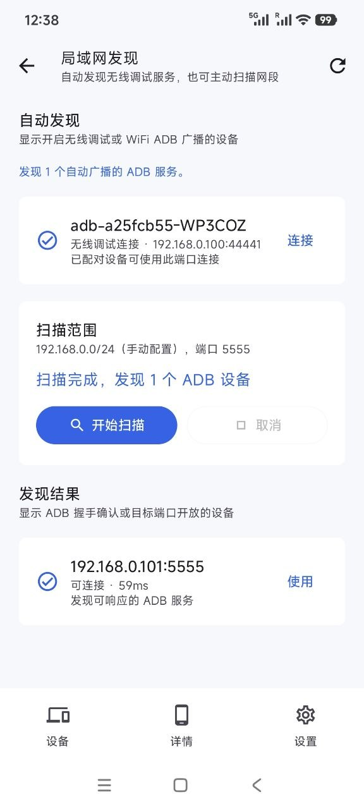
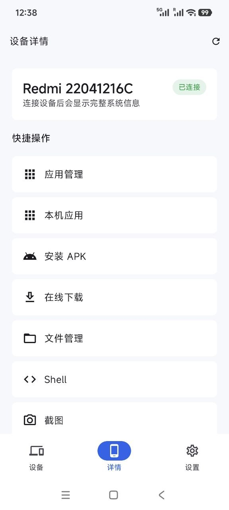

# sky adb

  

sky adb 是一款运行在 Android 手机上的 ADB 管理工具，用于通过 WiFi ADB / Wireless Debugging 管理手机、平板、电视和盒子。

## 功能特性

- 无线调试配对、连接、断开和最近设备记录
- 局域网自动发现和网段扫描，快速发现 adb 设备
- 查看设备基础信息、连接状态和截图
- 应用列表、分类筛选、搜索、启动、停止和卸载
- 本地 APK 安装，在线下载 APK 后安装到目标设备
- 本机用户应用导出并安装到目标设备
- 在线下载文件并推送到目标设备
- 目标设备文件管理、目录浏览、本地文件上传和设备文件下载
- 设备截图预览，需要时再保存到本机
- 目标设备系统日志查看和复制
- 模拟物理按键、虚拟遥控器和屏幕镜像
- Shell 命令执行和输出查看
- 诊断日志记录错误信息，便于排查连接和功能异常
- 默认端口、连接超时、命令超时、镜像画质和主题设置

## 如何使用

1. 在目标设备开启开发者选项和无线调试。
2. 在 sky adb 中输入目标设备 IP 和 ADB 端口，或先使用无线调试配对。
3. 连接成功后进入设备详情页，使用应用管理、APK 安装、文件管理、截图、遥控器、屏幕镜像或 Shell 等功能。
4. 常用设备会自动保存到最近设备列表，后续可快速回填连接信息。

## 预览

---

## 技术栈

- Kotlin
- Jetpack Compose
- Material 3
- Kadb
- scrcpy-server
- Coroutines / Flow
- DataStore
- OkHttp

### 鸣谢

- [Kadb](https://github.com/flyfishxu/Kadb)
- [scrcpy](https://github.com/Genymobile/scrcpy)

## Star 趋势

